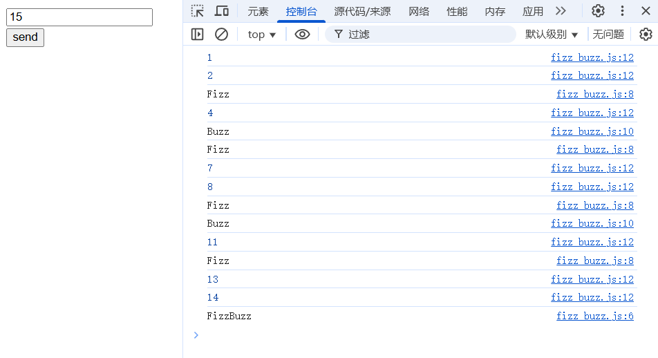

# 🧮 FizzBuzz JS 小练习

这是一个使用 HTML 和原生 JavaScript 编写的 FizzBuzz 小项目，练习基本的网页交互、DOM 操作和控制语句。

---

## 📁 项目结构
├── fizz_buzz.html # 主页面，包含输入框和按钮
├── fizz_buzz.js # JavaScript 文件，处理 FizzBuzz 逻辑
├── README.md # 项目说明文档
└── assets/
    └── Fizz_buzz.png # 页面截图

---

## 🚀 使用方法

1. 打开 `fizz_buzz.html` 文件（双击或使用 VS Code 的 Live Server 插件）。
2. 输入任意正整数。
3. 点击 `send` 按钮。
4. 打开开发者工具（按 F12），查看控制台（Console）输出。

---

## 🔢 功能说明

程序将从 1 输出到你输入的数字，并根据以下规则判断输出：

- 被 3 和 5 同时整除，输出 `FizzBuzz`
- 被 3 整除，输出 `Fizz`
- 被 5 整除，输出 `Buzz`
- 其他情况输出数字本身

---

## 💡 示例输出

---

欢迎一起学习前端基础，Enjoy coding! 💻✨

